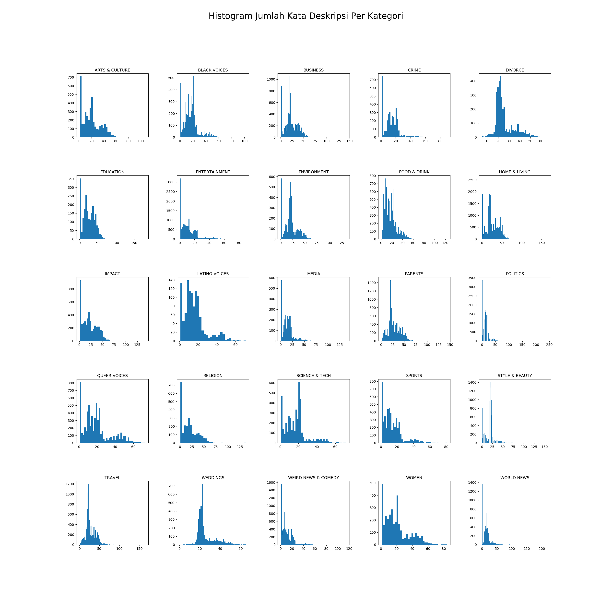

# News Category Predictor - Purwadhika Job Connector Data Science Batch 04 Final Project

News are the window of the world. They keep us updated on what's happening around us every day. With how the stream of news are going around nowadays, some category of news might interest us, while others might not. Of course, in order to save time, you probably want to know what kind of news you are about to read, though i myself doubt that. But in case you do, News Category Predictor can help you on trying to figure out which category does the news belong to by analyzing its headline and short description. Further applications such as filtering news with a web-scrapping program and recommendations by category are possible feats.

**This simple project is made to show a prediction of news category and serve it along with confidence statement as well as probability plot**

This project falls into the topic of classification with machine learning model.
The dataset used for model training is obtainable from [kaggle.com](https://www.kaggle.com/rmisra/news-category-dataset).
3 machine learning models were used and compared through, they are: 

1. Multinomial Naive Bayes Method
2. Complement Naive Bayes Method
3. Stochastic Gradient Descent Method

After comparing the three models, Complement Naive Bayes Method was chosen to be the one processing all the news data up until the prediction on the front-end interface which was made with the help of [Flask](https://palletsprojects.com/p/flask/) and other miscellaneous things.

As the preparation, the dataset were all analyzed, cleaned, and plotted with the help of [Pandas](https://pandas.pydata.org/) and [Matplotlib](https://matplotlib.org/). The model were dumped using joblib by *newsmodel.py*. Further on, the barplot which is available on the prediction page were made by utilizing [Seaborn](https://seaborn.pydata.org/)

Here is the collection of Histograms which were being plot by *newsplot.py*:

**How to run the Web App**
1. Clone/download this repo.
2. Open *newsflask.py*.
3. To include the data export to MySQL, make sure you have the same account profile and database, or just delete lines that have to do with MySQL syntax.
4. Run *newsflask.py*.
5. The server will run on localhost:5000 which bring you to the homepage:
    
    This page serves as the landing page with a few navigation buttons such as:
    - News Category Predictor: Takes you to the same page.
    - Categories / List of Categories: Scroll the page down to categories section which tell you categories available for predicting.
    - Start Predicting: Scroll the page down to predicting section, which is the main feature of the project.

    Categories:
    
    

    Start Prediction:
    

6. After you fill the required features, click on the Predict Category, it will bring you to the prediction result page with a Back button:
    
    Note that the news headline and description used for this result were taken from [60secondsnow.com](https://www.60secondsnow.com/).

MySQL was used only to store prediction data which the user has input through homepage on Predicting Category. *404 Error* also included on the template.

___
### I really hope this project could be any of use to you. Corrections and further applications are very welcome 😊

#### ✉ _agammsantos@yahoo.com_